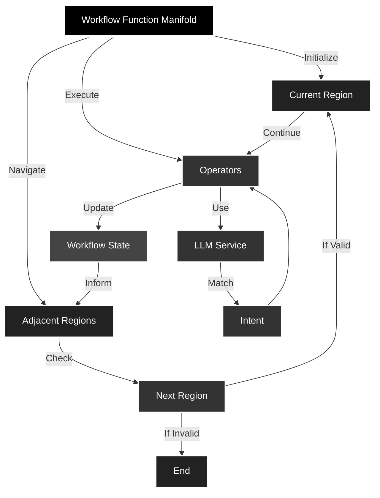

# workflow-function-manifold

> A TypeScript/JavaScript library for building dynamic, LLM-driven workflows
> using a region-based execution model


CLI: `npx workflow-function-manifold`

## Table of Contents

- [Overview](#overview)
- [Installation](#installation)
- [Quick Start](#quick-start)
- [Core Components](#core-components)
- [Complete Example](#complete-example)
- [API Reference](#api-reference)
- [State Management](#state-management)
- [LLM Integration](#llm-integration)
- [Error Handling](#error-handling)
- [Contributing](#contributing)
- [License](#license)

## Overview

`workflow-function-manifold` enables you to create dynamic workflows that:

- Navigate between different execution regions based on LLM-interpreted intents.
- Execute operations within regions based on state and context.
- Maintain workflow state across operations.
- Support flexible region-to-region connections.



## Installation

```bash
npm install workflow-function-manifold
```

## Quick Start

```javascript
import {
  WorkflowFunctionManifold,
  ManifoldRegion,
  WorkflowOperator,
  DummyLlmService,
} from 'workflow-function-manifold';

// Initialize the manifold with an LLM service
const llm = new DummyLlmService();
const manifold = new WorkflowFunctionManifold(llm);

// Create an operator
const analysisOperator = new WorkflowOperator('analysis', async state => {
  console.log('Analyzing data...');
  return { ...state, analyzed: true };
});

// Create and connect regions
const analysisRegion = new ManifoldRegion('analysis', [analysisOperator]);
manifold.addRegion(analysisRegion);

// Execute workflow
await manifold.navigate('analyze the data'); // This navigates to the 'analysis' region
await manifold.executeWorkflow('analyze the data'); // Executes the operator in the 'analysis' region

console.log(manifold.state); // { analyzed: true }
```

> **Note:** The `DummyLlmService` matches specific keywords in prompts. Ensure
> your prompts contain keywords like `'analyze'`, `'process'`, or `'transform'`
> for the default operators to function.

## Core Components

### WorkflowFunctionManifold

The main class that orchestrates workflow execution.

```javascript
const manifold = new WorkflowFunctionManifold(llmService);

// Add regions
manifold.addRegion(region);

// Navigate between regions
await manifold.navigate(prompt);

// Execute operations
await manifold.executeWorkflow(prompt);
```

### ManifoldRegion

Represents a workflow region containing operators and connections to other
regions.

```javascript
const region = new ManifoldRegion('regionName', [operator1, operator2]);

// Connect regions
region.connectTo(otherRegion);

// Add operators
region.addOperator(newOperator);
```

### WorkflowOperator

Defines operations that can be executed within regions.

```javascript
const operator = new WorkflowOperator('operatorName', async state => {
  // Modify state
  return newState;
});
```

### DummyLlmService

A simple LLM service simulation for intent matching.

```javascript
const llm = new DummyLlmService();
const intent = await llm.query('analyze the data');
// Returns: { confidence: 0.9, action: 'analysis' }
```

## Nested Manifolds

### NestedManifoldRegion

A `NestedManifoldRegion` allows embedding a `WorkflowFunctionManifold` inside a region. This enables creating hierarchical workflows where regions themselves contain sub-workflows.

```javascript
import {
  WorkflowFunctionManifold,
  NestedManifoldRegion,
  ManifoldRegion,
  WorkflowOperator,
  DummyLlmService,
} from 'workflow-function-manifold';

// Sub-workflow
const nestedLlm = new DummyLlmService();
const nestedManifold = new WorkflowFunctionManifold(nestedLlm);

const nestedOperator = new WorkflowOperator('nestedOperation', async state => {
  return { ...state, nested: true };
});

const nestedRegion = new ManifoldRegion('nestedRegion', [nestedOperator]);
nestedManifold.addRegion(nestedRegion);

// Main workflow
const mainLlm = new DummyLlmService();
const mainManifold = new WorkflowFunctionManifold(mainLlm);

const nestedManifoldRegion = new NestedManifoldRegion('nestedManifoldRegion', nestedManifold);
mainManifold.addRegion(nestedManifoldRegion);

await mainManifold.navigate('perform nested operation');
await mainManifold.executeWorkflow('perform nested operation');
```

## Complete Example

Here's a full example demonstrating a three-stage workflow:

```javascript
async function createWorkflow() {
  const llm = new DummyLlmService();
  const manifold = new WorkflowFunctionManifold(llm);

  // Create operators
  const analysisOp = new WorkflowOperator('analysis', async state => {
    return { ...state, analyzed: true };
  });
  const processingOp = new WorkflowOperator('processing', async state => {
    return { ...state, processed: true };
  });
  const transformOp = new WorkflowOperator('transformation', async state => {
    return { ...state, transformed: true };
  });

  // Create and connect regions
  const analysisRegion = new ManifoldRegion('analysis', [analysisOp]);
  const processingRegion = new ManifoldRegion('processing', [processingOp]);
  const transformRegion = new ManifoldRegion('transformation', [transformOp]);

  analysisRegion.connectTo(processingRegion);
  processingRegion.connectTo(transformRegion);

  // Add regions to manifold
  manifold.addRegion(analysisRegion);
  manifold.addRegion(processingRegion);
  manifold.addRegion(transformRegion);

  return manifold;
}

// Execute workflow
const manifold = await createWorkflow();
const prompts = [
  'analyze the data',
  'process the results',
  'transform the output',
];

for (const prompt of prompts) {
  await manifold.navigate(prompt);
  await manifold.executeWorkflow(prompt);
}

console.log(manifold.state); // Final state after all operations
```

## API Reference

### WorkflowFunctionManifold

#### Constructor

- `constructor(llmService: LLMService)`

#### Methods

- `addRegion(region: ManifoldRegion): void`
- `async navigate(prompt: string): Promise<boolean>`
- `async executeWorkflow(prompt: string): Promise<boolean>`

### ManifoldRegion

#### Constructor

- `constructor(name: string, operators: WorkflowOperator[] = [])`

#### Methods

- `addOperator(operator: WorkflowOperator): void`
- `connectTo(region: ManifoldRegion): void`
- `async getValidOperators(state: any): Promise<WorkflowOperator[]>`

### WorkflowOperator

#### Constructor

- `constructor(name: string, operation: (state: any) => Promise<any>)`

#### Methods

- `async execute(state: any): Promise<any>`

### NestedManifoldRegion
- Extends `ManifoldRegion` and embeds a `WorkflowFunctionManifold`.


## State Management

The workflow maintains state across operations. Each operator can access and
modify the state:

```javascript
const operator = new WorkflowOperator('example', async state => {
  // Access existing state
  const { previousValue } = state;

  // Return modified state
  return {
    ...state,
    newValue: 'updated',
  };
});
```

The updated state persists across operators and regions.

## LLM Integration

The system uses LLM services for intent recognition. The default
`DummyLlmService` provides basic intent matching, but you can implement your own
LLM service:

```javascript
class CustomLLMService {
  async query(prompt) {
    // Implement custom LLM logic
    return {
      confidence: number,
      action: string,
    };
  }
}
```

## Error Handling

This library includes basic error handling to ensure workflows run smoothly,
even when unexpected issues arise.

### Navigation Errors

- If a prompt doesn't match a valid adjacent region:
  - Logs a warning: `No valid region found for prompt: "<prompt>"`.

### Operator Execution Errors

- If no matching operator is found:
  - Logs a warning: `No matching operator found for intent: <intent>`.

### LLM Query Errors

- If issues arise during LLM queries:
  - Logs an error:
    `Error during navigation for prompt "<prompt>": <error message>`.

### Example Error Logging

```javascript
try {
  await manifold.navigate('unknown command');
} catch (error) {
  console.error('Critical navigation error:', error);
}

try {
  await manifold.executeWorkflow('perform unknown action');
} catch (error) {
  console.error('Critical execution error:', error);
}
```

## Contributing

1. Fork the repository.
2. Create your feature branch: `git checkout -b feature/my-feature`.
3. Commit your changes: `git commit -am 'Add new feature'`.
4. Push to the branch: `git push origin feature/my-feature`.
5. Submit a pull request.

## License

MIT © 2024 Geoff Seemueller
