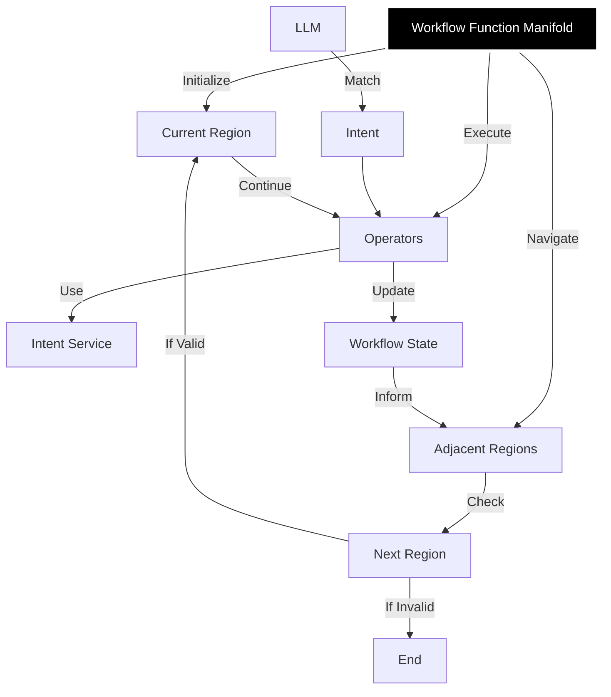

# workflow-function-manifold

> A TypeScript/JavaScript library for building dynamic, LLM-driven workflows using a region-based execution model.

### Used in production by:
- [AI](geoff.seemueller.io) 🫣

  


CLI: `npx workflow-function-manifold`

## Table of Contents

- [Overview](#overview)
- [Installation](#installation)
- [Quick Start](#quick-start)
- [Core Components](#core-components)
- [Complete Example](#complete-example)
- [API Reference](#api-reference)
- [State Management](#state-management)
- [LLM Integration](#llm-integration)
- [Error Handling](#error-handling)
- [Contributing](#contributing)
- [License](#license)

## Overview

`workflow-function-manifold` enables you to create dynamic workflows that:

- Navigate between different execution regions based on LLM-interpreted intents.
- Execute operations within regions using state and context.
- Maintain workflow state across operations.
- Support flexible region-to-region connections.



## Installation

Install the library via npm:

```bash
npm install workflow-function-manifold
```

Run a basic demonstration using the CLI:

```bash
npx workflow-function-manifold
```

## Quick Start

```javascript
import {
  WorkflowFunctionManifold,
  ManifoldRegion,
  WorkflowOperator,
  DummyIntentService,
} from 'workflow-function-manifold';

const llm = new DummyIntentService();
const manifold = new WorkflowFunctionManifold(llm);

const analysisOperator = new WorkflowOperator('analysis', async state => ({
  ...state,
  analyzed: true,
}));

const analysisRegion = new ManifoldRegion('analysis', [analysisOperator]);

manifold.addRegion(analysisRegion);

await manifold.navigate('analyze the data');
await manifold.executeWorkflow('analyze the data');
```

> **Note:** `DummyIntentService` uses basic keyword matching. Include keywords like `'analyze'`, `'process'`, or `'transform'` for default operators to work.

## Core Components

### `WorkflowFunctionManifold`

The main orchestrator for workflow execution.

```javascript
const manifold = new WorkflowFunctionManifold(llmService);
manifold.addRegion(region);
await manifold.navigate(prompt);
await manifold.executeWorkflow(prompt);
```

### `ManifoldRegion`

Represents a workflow region containing operators and connections to other regions.

```javascript
const region = new ManifoldRegion('regionName', [operator1, operator2]);
region.connectTo(otherRegion);
region.addOperator(newOperator);
```

### `WorkflowOperator`

Defines an operation that can be executed within a region.

```javascript
const operator = new WorkflowOperator('operatorName', async state => newState);
```

### `DummyIntentService`

A basic intent-matching service.

```javascript
const intentService = new DummyIntentService();
const intent = await intentService.query('analyze the data');
```

## Complete Example

Here's a complete workflow demonstration:

```javascript
async function createWorkflow() {
  const intentService = new DummyIntentService();
  const manifold = new WorkflowFunctionManifold(intentService);

  const analysisOp = new WorkflowOperator('analysis', async state => ({
    ...state,
    analyzed: true,
  }));

  const processingOp = new WorkflowOperator('processing', async state => ({
    ...state,
    processed: true,
  }));

  const transformOp = new WorkflowOperator('transformation', async state => ({
    ...state,
    transformed: true,
  }));

  const analysisRegion = new ManifoldRegion('analysis', [analysisOp]);
  const processingRegion = new ManifoldRegion('processing', [processingOp]);
  const transformRegion = new ManifoldRegion('transformation', [transformOp]);

  analysisRegion.connectTo(processingRegion);
  processingRegion.connectTo(transformRegion);

  manifold.addRegion(analysisRegion);
  manifold.addRegion(processingRegion);
  manifold.addRegion(transformRegion);

  return manifold;
}

const manifold = await createWorkflow();

const prompts = ['analyze the data', 'process the results', 'transform the output'];

for (const prompt of prompts) {
  await manifold.navigate(prompt);
  await manifold.executeWorkflow(prompt);
}
```

## API Reference

### `WorkflowFunctionManifold`

#### Constructor

- `constructor(intentService: IntentService)`

#### Methods

- `addRegion(region: ManifoldRegion | NestedManifoldRegion): void`
- `navigate(prompt: string): Promise<boolean>`
- `executeWorkflow(prompt: string): Promise<boolean>`

### `ManifoldRegion`

#### Constructor

- `constructor(name: string, operators: WorkflowOperator[] = [])`

#### Methods

- `addOperator(operator: WorkflowOperator): void`
- `connectTo(region: ManifoldRegion): void`

## State Management

Operators access and modify the state persistently:

```javascript
const operator = new WorkflowOperator('example', async state => ({
  ...state,
  newValue: 'updated',
}));
```

## Error Handling

### Navigation Errors

- Logs warnings for unmatched prompts.

### Operator Execution Errors

- Logs warnings for unmatched operators.

---

## Contributing

1. Fork the repository.
2. Create a new branch: `git checkout -b feature/my-feature`.
3. Commit changes: `git commit -m "Add my feature"`.
4. Push the branch: `git push origin feature/my-feature`.
5. Open a pull request.

## License

MIT © 2024 Geoff Seemueller
